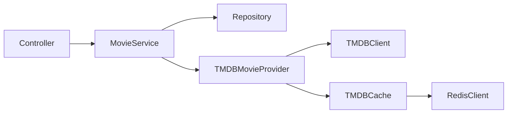

# Architecture

This document is the definitive architecture reference for the Cinelog Server codebase.

## Layered Architecture

The codebase follows a clean layered architecture:

1. **Controllers** (`app/controllers/`) — FastAPI route handlers that define API endpoints
2. **Services** (`app/services/`) — Business logic layer that orchestrates repository operations and external integrations
3. **Repositories** (`app/repository/`) — Data access layer using async SQLAlchemy
4. **Models** (`app/models/`) — SQLAlchemy ORM models representing database tables
5. **Schemas** (`app/schemas/`) — Pydantic models for request/response validation
6. **Dependencies** (`app/dependencies/`) — FastAPI dependency injection (e.g., JWT auth)
7. **Middleware** (`app/middleware/`) — Request processing middleware (e.g., CSRF protection)
8. **Config** (`app/config/`) — Application configuration (e.g., CORS)
9. **Infrastructure** (`app/infrastructure/`) — Shared PostgreSQL connection/session management, Redis client and cache-generation helpers
10. **Providers** (`app/providers/`) — Movie provider contracts, external integrations and their private HTTP/schema/cache code
11. **Types** (`app/types/`) — Reusable Annotated validation types, organized by domain
12. **Utils** (`app/utils/`) — Shared utilities (exceptions, error codes, cookie management, sanitization, datetime, ID validation)

## API Versioning

All routes are registered under the `/v1/` prefix:

| Controller | Prefix | Purpose |
|---|---|---|
| `auth_controller` | `/v1/auth` | Registration, login, logout, token refresh, password reset, CSRF |
| `movie_controller` | `/v1/movies` | TMDB movie search and details |
| `log_controller` | `/v1/logs` | Viewing log CRUD |
| `user_controller` | `/v1/users` | User info and profiles, including `PUT`/`DELETE /{handle}/follow` |
| `movie_rating_controller` | `/v1/movie-ratings` | Movie rating CRUD |
| `stats_controller` | `/v1/stats` | Viewing statistics |
| `notification_controller` | `/v1/notifications` | Notification inbox and read state |

## App Initialization

`app/__init__.py` uses a FastAPI lifespan context manager:

**Startup:**
1. Initialize the async SQLAlchemy engine from `DATABASE_URL` (`init_postgres_engine()` in `app/infrastructure/postgres.py`)
2. Initialize `RedisClient` from Redis config and fail fast if Redis is unreachable

**Shutdown:**
1. Close the shared Redis connection (`RedisClient.aclose_all()`)
2. Close owned TMDB provider connections (`TMDBMovieProvider.aclose_all()`)
3. Clear movie/log/rating service compositions holding the closed provider
4. Dispose the PostgreSQL engine (`close_postgres_engine()`)

**Middleware stack** (in order): RateLimitSessionMiddleware → CSRFMiddleware → CORSMiddleware

**Global exception handler** catches `AppException` and returns structured JSON via `ErrorSchema`.

## Key Patterns

**Dependency Flow:**

- Controllers depend on services via `Depends(get_*_service)` from `app/dependencies/service_dependency.py`
- Each `get_*_service` provider is `@lru_cache`-d and constructs the service with its repositories from `app/dependencies/repository_dependency.py`
- Repositories handle direct database operations through async SQLAlchemy sessions
- `LogService` composes `LogRepository` with `LogListCacheService`, which caches complete log-list responses

**Repository Conventions:**

- Repositories extend `RepositoryBase` (`app/repository/repository_base.py`), which accepts a `session_provider` (defaults to `get_async_session` from `app/infrastructure/postgres.py`); tests inject their own provider
- Each repository has a `Protocol` interface in `app/repository/*_repository_protocol.py` that services type-hint against
- Repository methods are instance methods; services should not call repository classes statically
- `FollowRepository` implements `FollowRepositoryProtocol` for idempotent follow mutations, active-user relationship reads, and profile follow summaries

**Error Handling:**

- Custom `AppException` class with structured `ErrorSchema` objects
- Centralized error codes in `app/utils/error_codes_utils.py`
- Global exception handler in `app/__init__.py` converts `AppException` to JSON responses

**Singleton Pattern:**

- `TMDBMovieProvider` uses a thread-safe singleton with `Lock()` — lazy initialization on first `get_instance()` call, one owned `TMDBClient` with a shared `httpx.AsyncClient`
- `RedisClient` uses a thread-safe singleton with `Lock()` — explicit initialization via `initialize(config)` during app startup

**Soft Delete:**

- `BaseEntity.active()` returns a SQLAlchemy criterion (`deleted IS FALSE`) — used by repository queries to exclude soft-deleted records

## Base Entity Pattern

Domain entity models inherit from `BaseEntity` (`app/models/base_model.py`), which provides:

- Soft delete support (`deleted`, `deleted_at`)
- Automatic timestamps (`created_at`, `updated_at`) via column defaults and `onupdate`
- `active()` class method returning a soft-delete-aware WHERE criterion

`UserFollow` is the deliberate exception: it inherits directly from `Base` because it is an edge table with a composite primary key, hard-delete semantics, and no standalone entity ID or soft-delete lifecycle.

Entity primary keys are PostgreSQL UUIDs generated by `gen_random_uuid()`. The `user_follows` edge instead uses its two user UUID foreign keys as a composite primary key.

## Data Models

### User (`users` table — `User`)

| Column | Type | Notes |
|---|---|---|
| `email` | `text` | Unique (case-insensitive index) |
| `handle` | `text` | Unique (case-insensitive index) |
| `first_name`, `last_name` | `text` | |
| `bio` | `text \| null` | |
| `profile_visibility` | `text` | `private` (default) or `public`, CHECK constraint |
| `date_of_birth` | `date \| null` | |
| `locale` | `text` | `en-US` (default), `fr-FR`, or `it-IT`, CHECK constraint; private, not exposed on public profiles |
| `password_hash` | `text \| null` | Nullable for legacy accounts |
| `reset_password_code` | `text \| null` | Password reset flow |
| `reset_password_expires` | `timestamptz \| null` | Password reset expiry |

**Indexes:** `uq_users_email_lower` (unique on `lower(email)`), `uq_users_handle_lower` (unique on `lower(handle)`)

### UserFollow (`user_follows` table — `UserFollow`)

| Column | Type | Notes |
|---|---|---|
| `follower_id` | `uuid` | FK to `users.id`; composite primary key; hard-delete cascade |
| `followed_id` | `uuid` | FK to `users.id`; composite primary key; hard-delete cascade |
| `created_at` | `timestamptz` | Database-owned creation timestamp |

**Constraints/Indexes:** composite primary key `(follower_id, followed_id)` provides concurrency-safe uniqueness, `ck_user_follows_not_self` rejects self-follows, and `ix_user_follows_followed_id` supports follower-count queries. Unfollow physically deletes the edge.

### Movie (`movies` table — `Movie`)

| Column | Type | Notes |
|---|---|---|
| `tmdb_id` | `integer` | Unique, indexed — links to TMDB |
| `title` | `text` | |
| `release_date` | `timestamp \| null` | |
| `overview` | `text \| null` | |
| `poster_path` | `text \| null` | |
| `vote_average` | `float \| null` | |
| `runtime` | `integer \| null` | Minutes |
| `original_language` | `text \| null` | |
| `tmdb_payload` | `jsonb \| null` | Opaque validated source snapshot |
| `tmdb_last_synced_at` | `timestamptz \| null` | Original successful detail observation time |

### Log (`logs` table — `Log`)

| Column | Type | Notes |
|---|---|---|
| `user_id` | `uuid` | FK to `users.id` |
| `movie_id` | `uuid` | FK to `movies.id` |
| `tmdb_id` | `integer` | Denormalized TMDB ID |
| `date_watched` | `timestamptz` | |
| `viewing_notes` | `text \| null` | |
| `poster_path` | `text \| null` | Denormalized |
| `watched_where` | `text` | `cinema`, `streaming`, `homeVideo`, `tv`, `other` (CHECK constraint) |

**Indexes:** `(user_id, date_watched DESC)`, `(user_id, date_watched DESC, created_at DESC)`, `(user_id, movie_id)`, `(tmdb_id, date_watched DESC)`, `(user_id, watched_where, created_at)`

### MovieRating (`movie_ratings` table — `MovieRating`)

| Column | Type | Notes |
|---|---|---|
| `user_id` | `uuid` | FK to `users.id` |
| `movie_id` | `uuid` | FK to `movies.id` |
| `tmdb_id` | `integer` | Denormalized |
| `rating` | `integer \| null` | CHECK constraint 1–10 |
| `review` | `text \| null` | |

**Constraints/Indexes:** unique `(user_id, tmdb_id)`, index `(user_id, movie_id)`

### Notification (`notifications` table — `Notification`)

| Column | Type | Notes |
|---|---|---|
| `recipient_id` | `uuid` | Required FK to `users.id` |
| `actor_id` | `uuid \| null` | Optional FK to `users.id` |
| `type` | `text` | Closed `NotificationType` value with CHECK constraint |
| `title`, `body` | `text` | Rendered presentation/history text |
| `deduplication_key` | `text \| null` | Optional per-recipient idempotency key |
| `read_at` | `timestamptz \| null` | Database-owned read timestamp |

**Indexes:** active recipient chronology, active unread recipient chronology, and partial unique `(recipient_id, deduplication_key)` for active non-null keys. Domain resource references belong in typed context tables rather than this common table.

## Authentication Flow

Cookie-based JWT authentication with CSRF double-submit protection. User IDs are UUIDs.

### Login (`POST /v1/auth/login`)

1. Find user by email (case-insensitive), verify password with bcrypt
2. Generate access token (15 min) and refresh token (7 days)
3. Set cookies:
   - `__Host-access_token` — HttpOnly, Secure, SameSite=strict, path=/
   - `refresh_token` — HttpOnly, Secure, SameSite=strict, path=/v1/auth/refresh
   - `__Host-csrf_token` — HttpOnly, Secure, SameSite=lax
4. Return CSRF token in response body

### Protected Requests

1. Client sends `__Host-access_token` cookie + `X-CSRF-Token` header
2. `auth_dependency` extracts JWT from cookie, validates signature/expiry, returns the `user_id` as a `UUID` (a non-UUID `sub` — e.g. a stale pre-migration token — is rejected with 401)
3. `CSRFMiddleware` validates `X-CSRF-Token` header matches `__Host-csrf_token` cookie (double-submit pattern)

### Token Refresh (`POST /v1/auth/refresh`)

Validates refresh token, rotates all cookies (access + refresh + CSRF), returns new CSRF token.

### Cookie Security

The `__Host-` prefix enforces: `Secure=true`, no `Domain`, `path=/` — prevents subdomain cookie injection and insecure connections.

## Services

| Service | Purpose |
|---|---|
| `AuthService` | Registration, login, forgot-password, reset-password flows |
| `TokenService` | JWT creation/decoding (HS256, access + refresh tokens) |
| `PasswordService` | Bcrypt hashing via `passlib.CryptContext` |
| `EmailService` | SMTP password reset emails (falls back to console logging in dev) |
| `MovieService` | Search/detail through `MovieProviderProtocol`, catalog lookup and lazy movie import |
| `LogService` | Viewing log CRUD with movie fetching and poster auto-population |
| `MovieRatingService` | Movie rating create/update/read |
| `UserService` | User info and profile retrieval with follower/following summaries |
| `FollowService` | Public-target eligibility, idempotent follow/unfollow mutations, and `follow.started` emission |
| `StatsService` | Viewing statistics with `asyncio.gather()` for parallel DB queries |
| `NotificationService` | Inbox pagination, batch response assembly, explicit read state, and cooldown-aware creation |

## Middleware

### Rate Limit Session Middleware (`app/middleware/rate_limit_session_middleware.py`)

- Manages `__Host-session_id` cookies only for the public auth routes that use session-scoped rate limits
- Reuses an existing session only when that session ID is known to Redis
- Cookie is used by `get_rate_limit_key` as a fallback identifier for rate limiting

### CSRF Middleware (`app/middleware/csrf_middleware.py`)

- Protects `POST`, `PUT`, `DELETE`, `PATCH` requests
- Exempt paths: login, register, forgot-password, reset-password, CSRF endpoint, refresh, docs, OpenAPI schema
- Validates `X-CSRF-Token` header matches `__Host-csrf_token` cookie value

### CORS Configuration (`app/config/cors.py`)

- Origins from `CORS_ORIGINS` env var (comma-separated) or dev defaults (`localhost:3000`, `localhost:5173`)
- Credentials enabled, allowed headers include `X-CSRF-Token`

## Schemas

HTTP request/response schemas use `BaseSchema` for camelCase alias generation (`alias_generator=to_camel`, `populate_by_name=True`). Internal movie DTOs and provider queries use Pydantic `BaseModel` without HTTP aliases. Internal movie transfer models use the `DTO` suffix; provider query names retain `Query`.

| File | Key Schemas |
|---|---|
| `auth_schemas.py` | `RegisterRequest`, `LoginRequest/Response`, `ForgotPasswordRequest`, `ResetPasswordRequest`, `CsrfTokenResponse` |
| `user_schemas.py` | `UserCreateRequest/Response`, `UserResponse`, `UserProfileResponse` with follow counts and requester-relative state |
| `log_schemas.py` | `LogCreateRequest/Response`, `LogUpdateRequest`, `LogListItem/Response` |
| `movie_schemas.py` | `MovieUpdateRequest`, `MovieResponse` |
| `movie_rating_schemas.py` | `MovieRatingCreateUpdateRequest`, `MovieRatingResponse`, `MovieRatingStats` |
| `stats_schemas.py` | `StatsSummary`, `StatsDistribution`, `StatsPace`, `StatsResponse` |
| `movie_api_schemas.py` | Released numeric movie search/detail responses |
| `movie_provider_schemas.py` | Neutral provider queries, `MovieMetadataDTO`, `MovieSearchResultDTO` and nested DTOs |
| `movie_import_schemas.py` | `MovieCreateDTO`, the repository creation input, and its `from_metadata()` conversion |
| `error_schemas.py` | `ErrorSchema` (error_code_name, error_code, error_message, error_description) |
| `notification_schemas.py` | Common notification response, list query/response, creation data, bulk-read response |

## Utils

| Utility | Purpose |
|---|---|
| `auth_utils.py` | Cookie management: `set_auth_cookies()`, `set_csrf_cookie()`, `clear_auth_cookies()`, `set_rate_limit_session_id()` |
| `rate_limit_utils.py` | Rate limit key function (`get_rate_limit_key`) and custom 429 exception handler |
| `exceptions_utils.py` | `AppException` — custom exception wrapping `ErrorSchema` |
| `error_codes_utils.py` | `ErrorCodes` class with predefined error schemas |
| `sanitize_utils.py` | HTML tag stripping, name/handle pattern validation |
| `datetime_utils.py` | UTC date/datetime conversion helpers |
| `id_utils.py` | `is_valid_uuid()` string validation |
| `cursor_pagination_utils.py` | Versioned opaque cursor encoding and strict decoding |

## User Repository Deletion Methods

The user repository provides two deletion strategies:

- `delete_user()`: Soft delete (sets `deleted=True`)
- `delete_user_oblivion()`: GDPR-compliant deletion that obscures all user information

## TMDB Integration

Movie controllers delegate to `MovieService`, which receives a `MovieProviderProtocol` defined in `app/providers/movie_provider_protocol.py`. This contract stays independent of concrete integrations. The production implementation is `TMDBMovieProvider`, exported by `app/providers/tmdb/`. Its private `client.py`, `schemas.py`, `validation.py` and `cache.py` own HTTP, wire DTOs, upstream parsing/validation and source caching; `provider.py` maps complete observations to neutral `MovieMetadataDTO` and search observations to separate Cinelog types. TMDB-specific date handling and score constraints stay inside the provider; `app/types/` contains reusable Cinelog validation types.



The public numeric movie schemas remain separate and retain all released fields. Internal source identity never assigns a canonical UUID. `create_movie(data: MovieCreateDTO)` is the repository's single creation method: it persists neutral imports and opaque snapshots into existing columns, or returns the existing active movie on a source-identity conflict. The original UTC `observed_at` becomes `tmdb_last_synced_at`. First imports remain `en-US`, while live search/detail use the resolved locale.

Search keys use `cinelog:tmdb:search:v2:{locale}:{normalized_query}`. Detail keys add a film/locale generation: `cinelog:tmdb:details:v2:{locale}:{external_id}:generation:{generation}`. Cache hits retain their acquisition timestamp. Internal `force_refresh=True` bumps that generation and requests fresh data; #227 owns the future trigger policy.

The HTTP client uses a Bearer token and finite timeout. Source not-found, unavailability and invalid responses become distinct application errors (404, 503, 502). Redis failures preserve their existing behavior.

Shutdown closes only owned HTTP clients and clears cached movie/log/rating compositions. E2E injects a fake through the provider factory; HTTP and mapping are tested independently. See [TMDB Movie Provider](docs/technical/tmdb-service.md).

## Caching

`RedisClient` in `app/infrastructure/redis.py` is shared infrastructure for caching, rate limiting support and registration verification:

- **Required dependency:** Redis must be reachable during FastAPI startup. `app/__init__.py` initializes `RedisClient`, pings Redis via `health_check()`, and raises `RuntimeError` if Redis is unavailable.
- **Configuration:** `REDIS_URL` selects the Redis instance and defaults to `redis://localhost:6379/0`; there is no `REDIS_ENABLED` toggle.
- **Error behavior:** `RedisClient` is a low-level wrapper and lets Redis errors propagate. Higher-level callers decide whether to fail open or fail closed. `LogListCacheService` catches cache errors and falls back to PostgreSQL; registration verification, rate limiting, stats caching, and TMDB caching require Redis to remain healthy.
- **Serialization:** Callers pass JSON-ready dicts to `set()` and revalidate after `get()` — keeps RedisClient model-agnostic. `LogListCacheService` serializes the complete Pydantic log-list response.
- **Key naming:** `cinelog:{entity}:{identifier}` — key construction is the caller's responsibility
- **Default TTL:** 300 seconds (5 minutes), configurable via `REDIS_DEFAULT_TTL`
- **Pattern invalidation:** Uses `SCAN` (not `KEYS`) for production-safe pattern-based cache invalidation
- **Lifecycle:** Initialized during app startup in `app/__init__.py`, closed during shutdown

Shared generation functions live in `app/infrastructure/cache_generation.py`. `LogListCacheService` and `TMDBCache` pass their Redis client, context and scope to these functions. The module owns the `cinelog:cache-generation:{context}:{scope_id}` namespace, missing-counter default and atomic increment; `RedisClient` exposes only the underlying `hget`/`hincrby` operations. Cache layers retain their invalidation policies and write fills using the generation captured before fetching data.

## PostgreSQL Connection

Connection management lives in `app/infrastructure/postgres.py`:

- `DATABASE_URL` env var (a `postgresql+asyncpg://` connection string) is required; startup fails without it
- `init_postgres_engine()` creates a process-wide async engine (`pool_pre_ping=True`) and session factory
- `get_async_session()` yields `AsyncSession` instances for repositories
- `close_postgres_engine()` disposes the engine during app shutdown

## Testing Approach

Tests use:

- `pytest` for test framework
- `pytest-postgresql` for repository tests against a real ephemeral PostgreSQL instance (per-test databases via `DatabaseJanitor`)
- `freezegun` for time-based testing
- Mock pattern for isolating services from repositories

## Migrations

Database schema migrations are managed with **Alembic** (`alembic/` directory):

```bash
make db-schema-migrate          # Apply pending migrations (alembic upgrade head)
make db-schema-migrate-dry-run  # Preview SQL without applying (alembic upgrade head --sql)
make db-schema-rollback         # Roll back one revision (alembic downgrade -1)
```

In production, the `db-migrate` service in `docker-compose.prod.yml` runs `alembic upgrade head` before the API starts.

Revision files are named `<NNN>_<verb>_<subject>.py` — table creations use `<NNN>_create_<table>_table.py` — and each file's `revision` string matches its filename stem. Revision ids are immutable once merged or applied, because they live in `alembic_version` and in the next migration's `down_revision`. See the migration naming rule in [`AGENTS.md`](AGENTS.md#naming-conventions).

See `docs/technical/postgres-migration.md` for the history of the MongoDB → PostgreSQL migration.
