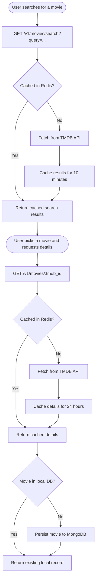

# TMDB Movie Service

**Last Updated:** 2026-03-21

## Table of Contents

- [Overview](#overview)
- [Authentication](#authentication)
- [Endpoints](#endpoints)
  - [Search Movies](#search-movies)
  - [Get Movie Details](#get-movie-details)
- [Movie Data Flow](#movie-data-flow)
- [Response Fields](#response-fields)
  - [Search Result Item](#search-result-item)
  - [Full Movie Details](#full-movie-details)
- [Edge Cases & Error Handling](#edge-cases--error-handling)
- [Related Documents](#related-documents)

---

## Overview

The TMDB Movie Service exposes two endpoints that allow authenticated users to search for movies and retrieve detailed information about a specific film. Movie data is sourced from [The Movie Database (TMDB)](https://www.themoviedb.org/) and is persisted locally the first time a movie is looked up, making subsequent access faster and independent of the external API.

## Authentication

Both endpoints require a valid session. Requests must include the `__Host-access_token` cookie and the `X-CSRF-Token` header. Unauthenticated requests will receive a `401 Unauthorized` response. See [Authentication](authentication.md) for the full login and token-refresh flow.

---

## Endpoints

### Search Movies

```
GET /v1/movies/search?query={query}
```

Searches TMDB for movies matching the provided query string. Returns a paginated list of results.

| Parameter | Type | Required | Description |
|-----------|------|----------|-------------|
| `query` | string | Yes | The search term (movie title or partial title) |

**Example request:**

```
GET /v1/movies/search?query=inception
```

**Example response (200 OK):**

```json
{
  "page": 1,
  "totalResults": 42,
  "totalPages": 3,
  "results": [
    {
      "id": 27205,
      "title": "Inception",
      "overview": "Cobb, a skilled thief who commits corporate espionage...",
      "releaseDate": "2010-07-16",
      "posterPath": "/9gk7adHYeDvHkCSEqAvQNLV5Uge.jpg",
      "backdropPath": "/s3TBrRGB1iav7gFOCNx3H31MoES.jpg",
      "voteAverage": 8.4,
      "genreIds": [28, 878, 12],
      "originalLanguage": "en",
      "originalTitle": "Inception"
    }
  ]
}
```

Each item in `results` represents a single movie match. Use the `id` field as the `tmdb_id` when calling the details endpoint.

---

### Get Movie Details

```
GET /v1/movies/{tmdb_id}
```

Returns the full details for a single movie identified by its TMDB ID. If this is the first time the movie has been requested, the data is fetched from TMDB and persisted to the local database for future use.

| Parameter | Type | Required | Description |
|-----------|------|----------|-------------|
| `tmdb_id` | integer | Yes | The TMDB movie ID (obtained from a search result) |

**Example request:**

```
GET /v1/movies/27205
```

**Example response (200 OK):**

```json
{
  "id": 27205,
  "title": "Inception",
  "originalTitle": "Inception",
  "overview": "Cobb, a skilled thief who commits corporate espionage...",
  "releaseDate": "2010-07-16",
  "posterPath": "/9gk7adHYeDvHkCSEqAvQNLV5Uge.jpg",
  "backdropPath": "/s3TBrRGB1iav7gFOCNx3H31MoES.jpg",
  "voteAverage": 8.4,
  "voteCount": 34521,
  "runtime": 148,
  "budget": 160000000,
  "revenue": 836848102,
  "status": "Released",
  "tagline": "Your mind is the scene of the crime.",
  "homepage": "https://www.warnerbros.com/movies/inception",
  "imdbId": "tt1375666",
  "originalLanguage": "en",
  "popularity": 96.3,
  "adult": false,
  "genres": [
    { "id": 28, "name": "Action" },
    { "id": 878, "name": "Science Fiction" }
  ],
  "productionCompanies": [
    { "id": 174, "name": "Warner Bros. Pictures", "logoPAth": null, "originCountry": "US" }
  ],
  "productionCountries": [
    { "iso31661": "US", "name": "United States of America" }
  ],
  "spokenLanguages": [
    { "iso6391": "en", "name": "English", "englishName": "English" }
  ]
}
```

---

## Movie Data Flow

The diagram below shows how a movie moves from a user's search through to permanent local storage.



**Key points about this flow:**

- Search results are cached for 10 minutes to reduce TMDB API calls for repeated queries.
- Full movie details are cached for 24 hours since this data changes infrequently.
- A movie is written to the local database only when it is first fully fetched — not when it appears in a search list.
- Once persisted locally, a movie record is available to other features (logs, ratings) by its internal MongoDB ID.

---

## Response Fields

### Search Result Item

| Field | Type | Description |
|-------|------|-------------|
| `id` | integer | TMDB movie ID — use this as `tmdb_id` in the details endpoint |
| `title` | string | Display title |
| `overview` | string | Short plot summary |
| `releaseDate` | string | Release date in `YYYY-MM-DD` format |
| `posterPath` | string \| null | Relative poster image path (prepend TMDB image base URL) |
| `backdropPath` | string \| null | Relative backdrop image path |
| `voteAverage` | float | Average TMDB user rating (0–10) |
| `genreIds` | integer[] | List of genre IDs |
| `originalLanguage` | string | ISO 639-1 language code |
| `originalTitle` | string | Title in the original language |

### Full Movie Details

Includes all fields from the search result item, plus:

| Field | Type | Description |
|-------|------|-------------|
| `voteCount` | integer | Total number of votes |
| `runtime` | integer \| null | Runtime in minutes |
| `budget` | integer | Production budget (USD) |
| `revenue` | integer | Box office revenue (USD) |
| `status` | string | Release status (e.g. `Released`, `In Production`) |
| `tagline` | string \| null | Promotional tagline |
| `homepage` | string \| null | Official website URL |
| `imdbId` | string \| null | IMDB identifier (e.g. `tt1375666`) |
| `popularity` | float | TMDB popularity score |
| `adult` | boolean | Whether the film is adult content |
| `genres` | object[] | Full genre objects with `id` and `name` |
| `productionCompanies` | object[] | Production company details |
| `productionCountries` | object[] | Production country details |
| `spokenLanguages` | object[] | Spoken language details |

---

## Edge Cases & Error Handling

| Scenario | System Behavior | User-Facing Outcome |
|----------|----------------|---------------------|
| Missing `query` parameter | FastAPI validation rejects the request | `422 Unprocessable Entity` |
| `tmdb_id` is not an integer | FastAPI validation rejects the request | `422 Unprocessable Entity` |
| TMDB returns no results | Empty `results` array is returned | `200 OK` with `"results": []` |
| TMDB API returns a non-2xx status | `raise_for_status()` raises an error, propagated as a 5xx | `500 Internal Server Error` |
| Redis is unavailable | Cache is bypassed silently; TMDB is called directly | No user impact; slightly slower response |
| `tmdb_id` not found on TMDB | TMDB returns 404, propagated as 5xx | `500 Internal Server Error` |

---

## Related Documents

- [Technical: TMDB Service — Implementation Details](../technical/tmdb-service.md)
- [Functional: Authentication](authentication.md)
