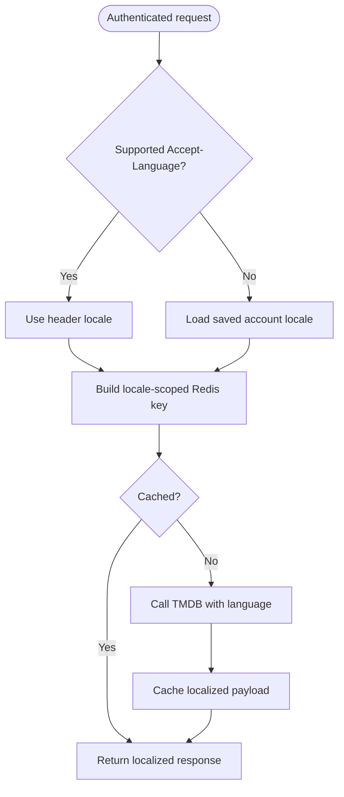

# TMDB Movie Service

**Last Updated:** 2026-03-21

## Table of Contents

- [Overview](#overview)
- [Authentication](#authentication)
- [Endpoints](#endpoints)
  - [Search Movies](#search-movies)
  - [Get Movie Details](#get-movie-details)
- [Movie Data Flow](#movie-data-flow)
- [Response Fields](#response-fields)
  - [Search Result Item](#search-result-item)
  - [Full Movie Details](#full-movie-details)
- [Edge Cases & Error Handling](#edge-cases--error-handling)
- [Related Documents](#related-documents)

---

## Overview

The TMDB Movie Service exposes two endpoints that allow authenticated users to search for movies and retrieve detailed information about a specific film. Live data is sourced from [The Movie Database (TMDB)](https://www.themoviedb.org/), localized for the authenticated viewer, and cached in Redis.

## Authentication

Both endpoints require a valid session. Requests must include the `__Host-access_token` cookie. Clients should send the active locale in `Accept-Language`; the server falls back to the saved account locale. Unauthenticated requests receive `401 Unauthorized`. See [Authentication](authentication.md) and [Account Localization](localization.md).

---

## Endpoints

### Search Movies

```
GET /v1/movies/search?query={query}
```

Searches TMDB for movies matching the provided query string. Returns a paginated list of results.

| Parameter | Type | Required | Description |
|-----------|------|----------|-------------|
| `query` | string | Yes | The search term (movie title or partial title) |

**Example request:**

```
GET /v1/movies/search?query=inception
Accept-Language: fr-FR
```

**Example response (200 OK):**

```json
{
  "page": 1,
  "totalResults": 42,
  "totalPages": 3,
  "results": [
    {
      "id": 27205,
      "title": "Inception",
      "overview": "Cobb, a skilled thief who commits corporate espionage...",
      "releaseDate": "2010-07-16",
      "posterPath": "/9gk7adHYeDvHkCSEqAvQNLV5Uge.jpg",
      "backdropPath": "/s3TBrRGB1iav7gFOCNx3H31MoES.jpg",
      "voteAverage": 8.4,
      "genreIds": [28, 878, 12],
      "originalLanguage": "en",
      "originalTitle": "Inception"
    }
  ]
}
```

Each item in `results` represents a single movie match. Use the `id` field as the `tmdb_id` when calling the details endpoint.

---

### Get Movie Details

```
GET /v1/movies/{tmdb_id}
```

Returns live details for a single movie identified by its TMDB ID, localized using the resolved request locale.

| Parameter | Type | Required | Description |
|-----------|------|----------|-------------|
| `tmdb_id` | integer | Yes | The TMDB movie ID (obtained from a search result) |

**Example request:**

```
GET /v1/movies/27205
Accept-Language: it-IT
```

**Example response (200 OK):**

```json
{
  "id": 27205,
  "title": "Inception",
  "originalTitle": "Inception",
  "overview": "Cobb, a skilled thief who commits corporate espionage...",
  "releaseDate": "2010-07-16",
  "posterPath": "/9gk7adHYeDvHkCSEqAvQNLV5Uge.jpg",
  "backdropPath": "/s3TBrRGB1iav7gFOCNx3H31MoES.jpg",
  "voteAverage": 8.4,
  "voteCount": 34521,
  "runtime": 148,
  "budget": 160000000,
  "revenue": 836848102,
  "status": "Released",
  "tagline": "Your mind is the scene of the crime.",
  "homepage": "https://www.warnerbros.com/movies/inception",
  "imdbId": "tt1375666",
  "originalLanguage": "en",
  "popularity": 96.3,
  "adult": false,
  "genres": [
    { "id": 28, "name": "Action" },
    { "id": 878, "name": "Science Fiction" }
  ],
  "productionCompanies": [
    { "id": 174, "name": "Warner Bros. Pictures", "logoPath": null, "originCountry": "US" }
  ],
  "productionCountries": [
    { "iso31661": "US", "name": "United States of America" }
  ],
  "spokenLanguages": [
    { "iso6391": "en", "name": "English", "englishName": "English" }
  ]
}
```

---

## Movie Data Flow

The diagram below shows locale resolution and live TMDB caching.


```mermaid
flowchart TD
    A([Authenticated request]) --> B{Supported Accept-Language?}
    B -- Yes --> C[Use header locale]
    B -- No --> D[Load saved account locale]
    C --> E[Build locale-scoped Redis key]
    D --> E
    E --> F{Cached?}
    F -- Yes --> G[Return localized response]
    F -- No --> H[Call TMDB with language]
    H --> I[Cache localized payload]
    I --> G
```

**Key points about this flow:**

- Search results are cached for 10 minutes and details for 24 hours.
- Locale is part of every TMDB cache key, so localized payloads never share entries.
- Live search/details endpoints do not persist localized payloads to PostgreSQL.
- Logs and ratings create canonical `en-US` movie rows through the internal `MovieService`; saved log metadata remains canonical for now.

---

## Response Fields

### Search Result Item

| Field | Type | Description |
|-------|------|-------------|
| `id` | integer | TMDB movie ID — use this as `tmdb_id` in the details endpoint |
| `title` | string | Display title |
| `overview` | string | Short plot summary |
| `releaseDate` | string | Release date in `YYYY-MM-DD` format |
| `posterPath` | string \| null | Relative poster image path (prepend TMDB image base URL) |
| `backdropPath` | string \| null | Relative backdrop image path |
| `voteAverage` | float | Average TMDB user rating (0–10) |
| `genreIds` | integer[] | List of genre IDs |
| `originalLanguage` | string | ISO 639-1 language code |
| `originalTitle` | string | Title in the original language |

### Full Movie Details

Includes all fields from the search result item, plus:

| Field | Type | Description |
|-------|------|-------------|
| `voteCount` | integer | Total number of votes |
| `runtime` | integer \| null | Runtime in minutes |
| `budget` | integer | Production budget (USD) |
| `revenue` | integer | Box office revenue (USD) |
| `status` | string | Release status (e.g. `Released`, `In Production`) |
| `tagline` | string \| null | Promotional tagline |
| `homepage` | string \| null | Official website URL |
| `imdbId` | string \| null | IMDB identifier (e.g. `tt1375666`) |
| `popularity` | float | TMDB popularity score |
| `adult` | boolean | Whether the film is adult content |
| `genres` | object[] | Full genre objects with `id` and `name` |
| `productionCompanies` | object[] | Production company details |
| `productionCountries` | object[] | Production country details |
| `spokenLanguages` | object[] | Spoken language details |

---

## Edge Cases & Error Handling

| Scenario | System Behavior | User-Facing Outcome |
|----------|----------------|---------------------|
| Missing `query` parameter | FastAPI validation rejects the request | `422 Unprocessable Entity` |
| `tmdb_id` is not an integer | FastAPI validation rejects the request | `422 Unprocessable Entity` |
| TMDB returns no results | Empty `results` array is returned | `200 OK` with `"results": []` |
| TMDB API returns a non-2xx status | `raise_for_status()` raises an error, propagated as a 5xx | `500 Internal Server Error` |
| Redis is unavailable at startup | API startup fails because Redis is required | Service is unavailable until Redis is healthy |
| Redis becomes unavailable at runtime | Cache operation errors can fail TMDB requests | `500 Internal Server Error` |
| `tmdb_id` not found on TMDB | TMDB returns 404, propagated as 5xx | `500 Internal Server Error` |

---

## Related Documents

- [Account Localization](localization.md)
- [Technical: TMDB Service — Implementation Details](../technical/tmdb-service.md)
- [Functional: Authentication](authentication.md)
