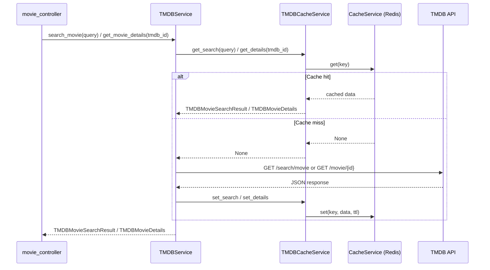
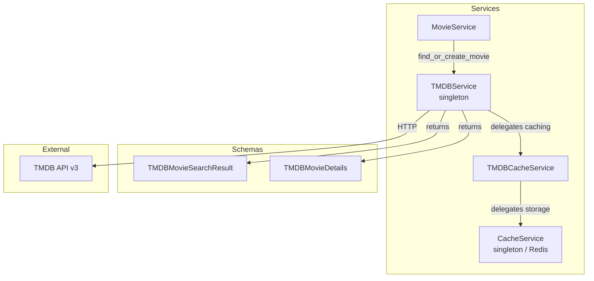

# TMDB Service — Technical Details

**Last Updated:** 2026-03-21

## Table of Contents

- [Overview](#overview)
- [Architecture](#architecture)
- [Singleton Lifecycle](#singleton-lifecycle)
- [HTTP Client](#http-client)
- [Caching Layer](#caching-layer)
  - [Cache Keys](#cache-keys)
  - [TTL Configuration](#ttl-configuration)
  - [Graceful Degradation](#graceful-degradation)
- [Request & Error Handling](#request--error-handling)
- [MovieService Integration](#movieservice-integration)
- [Environment Variables](#environment-variables)
- [Key Files](#key-files)
- [Decision Records (Why Not)](#decision-records-why-not)
- [Troubleshooting & Common Gotchas](#troubleshooting--common-gotchas)
- [Related Documents](#related-documents)

---

## Overview

`TMDBService` is a singleton async HTTP client that proxies requests to [The Movie Database API v3](https://developer.themoviedb.org/docs). It handles movie search and full movie detail retrieval, with a dedicated `TMDBCacheService` wrapping the shared Redis `CacheService` to reduce external API calls. The service is closed during application shutdown via `aclose_all()`.

---

## Architecture





---

## Singleton Lifecycle

`TMDBService` implements a thread-safe lazy singleton using a class-level `Lock()`.

```python
# First call — creates the instance
service = TMDBService.get_instance()

# Subsequent calls — returns the same instance
service = TMDBService.get_instance()
```

**Key lifecycle methods:**

| Method | Description |
|--------|-------------|
| `get_instance()` | Class method. Acquires `_singleton_lock`, creates instance if `_singleton is None`, returns it. |
| `aclose()` | Closes the `httpx.AsyncClient` if this instance owns it, sets `_closed = True`, clears `_singleton`. |
| `aclose_all()` | Class method called during app shutdown in `app/__init__.py`. Safely closes the singleton under lock. |

The `_closed` flag gates all method calls via `_ensure_open()`. Calling any async method on a closed service raises `RuntimeError("TMDBService client is closed")`.

The controller at `app/controllers/movie_controller.py` calls `TMDBService.get_instance()` at module load time, so the singleton is initialized on first import of the router.

---

## HTTP Client

`TMDBService` uses a single shared `httpx.AsyncClient` for all requests.

- **Base URL:** `https://api.themoviedb.org/3/`
- **Auth:** `Authorization: Bearer <TMDB_API_KEY>` header, assembled by `_headers()`
- **Timeout:** `httpx.Timeout(TMDB_TIMEOUT)` applied uniformly to all requests
- **Ownership:** The client is owned by the service (`_owns_client = True`) unless injected via the constructor (used in tests)

---

## Caching Layer

`TMDBCacheService` is a thin wrapper around the shared `CacheService` (Redis) that owns all TMDB-specific key construction, serialization, and TTL values.

### Cache Keys

| Operation | Key Format | Example |
|-----------|-----------|---------|
| Search | `cinelog:tmdb:search:{normalized_query}` | `cinelog:tmdb:search:inception` |
| Details | `cinelog:tmdb:details:{tmdb_id}` | `cinelog:tmdb:details:27205` |

The search key is normalized via `query.strip().lower()` before insertion and lookup, so `" Inception "` and `"inception"` resolve to the same cache entry.

### TTL Configuration

| Variable | Default | Scope |
|----------|---------|-------|
| `TMDB_SEARCH_CACHE_TTL` | `600` (10 min) | Search results — short TTL because rankings shift |
| `TMDB_DETAILS_CACHE_TTL` | `86400` (24 h) | Movie details — long TTL because metadata is stable |

Both TTLs are read once at module import via `os.getenv` and cast to `int`.

### Graceful Degradation

`TMDBCacheService` resolves the `CacheService` singleton lazily on first use via its `_cache` property. If `CacheService.get_instance()` raises `RuntimeError` (Redis not initialized or disabled), `_cache_instance` is set to `None` and all cache operations become no-ops that return `None` or return immediately. This means TMDB calls always succeed even when Redis is unavailable — they simply skip caching and call TMDB directly.

The `REDIS_ENABLED` env var (managed by `CacheService`) is the primary toggle. See [Redis Caching](redis-caching.md) for details on that layer.

---

## Request & Error Handling

Both `search_movie` and `get_movie_details` call `response.raise_for_status()` immediately after the HTTP call. Any non-2xx response from the TMDB API (including 404 for an unknown `tmdb_id`) raises an `httpx.HTTPStatusError`, which propagates up the call stack and results in a `500 Internal Server Error` for the API consumer.

No retry logic is currently implemented. Failed requests are not cached.

---

## MovieService Integration

`MovieService.find_or_create_movie(tmdb_id)` is the primary internal consumer of `TMDBService`. It implements a lazy-persistence pattern:

```
1. Query MongoDB for an existing Movie document with the given tmdb_id
2. If found → return it immediately (no TMDB call)
3. If not found → call TMDBService.get_movie_details(tmdb_id)
4. Pass the TMDBMovieDetails to MovieRepository.create_from_tmdb_data()
5. Return the newly created Movie document
```

This means a movie is written to MongoDB exactly once — on first access. All subsequent lookups for the same `tmdb_id` are served from the local database. Callers within the application (e.g. `LogService`) use `find_or_create_movie` rather than calling `TMDBService` directly.

---

## Environment Variables

| Variable | Default | Description |
|----------|---------|-------------|
| `TMDB_API_KEY` | — | **Required.** Bearer token for TMDB API v3. |
| `TMDB_TIMEOUT` | `10` | Request timeout in seconds for `httpx.AsyncClient`. |
| `TMDB_SEARCH_CACHE_TTL` | `600` | Redis TTL in seconds for search result cache entries. |
| `TMDB_DETAILS_CACHE_TTL` | `86400` | Redis TTL in seconds for movie detail cache entries. |

All four variables are read at module import time. Changing them requires an application restart.

---

## Key Files

| File | Purpose |
|------|---------|
| `app/services/tmdb_service.py` | `TMDBService` singleton — HTTP client, search, details methods, lifecycle |
| `app/services/tmdb_cache_service.py` | `TMDBCacheService` — key construction, TTL management, serialization |
| `app/schemas/tmdb_schemas.py` | `TMDBMovieSearchResult`, `TMDBMovieSearchResultItem`, `TMDBMovieDetails`, and supporting schemas |
| `app/controllers/movie_controller.py` | FastAPI router — `GET /v1/movies/search` and `GET /v1/movies/{tmdb_id}` |
| `app/services/movie_service.py` | `MovieService.find_or_create_movie()` — lazy persist integration point |

---

## Decision Records (Why Not)

**Why not initialize the singleton during app startup (like `CacheService`)?**
`CacheService` requires a configuration object (`REDIS_URL`, `REDIS_ENABLED`) that must be available at startup. `TMDBService` reads its config directly from environment variables and creates its `httpx.AsyncClient` without any external dependency, so lazy initialization on first `get_instance()` call is sufficient and keeps the startup sequence simpler.

**Why a separate `TMDBCacheService` instead of calling `CacheService` directly from `TMDBService`?**
Separating cache concerns into `TMDBCacheService` keeps key construction, TTL constants, and serialization/deserialization logic out of `TMDBService`. This makes both classes easier to test in isolation — `TMDBService` tests can inject a mock cache, and cache behavior can be tested independently.

**Why normalize the search query for the cache key?**
TMDB's search is case-insensitive. Normalizing to lowercase and stripping whitespace ensures that `"Inception"`, `"inception"`, and `" inception "` all hit the same cache entry, preventing redundant API calls for equivalent queries.

**Why is `raise_for_status()` used instead of checking the status code manually?**
It produces a structured `httpx.HTTPStatusError` with the full request and response context attached, which makes debugging easier. The trade-off is that TMDB 4xx errors (e.g. 404 for an unknown movie) surface as 5xx to the API consumer — acceptable for now since the consumer is expected to use valid IDs obtained from the search endpoint.

---

## Troubleshooting & Common Gotchas

| Problem | Cause | Solution |
|---------|-------|----------|
| `RuntimeError: TMDBService client is closed` | `aclose_all()` was called (app shutdown) before the request completed, or the service was closed in a test without being re-initialized | In tests, inject a fresh `TMDBService` instance directly; do not rely on the singleton across test boundaries |
| All TMDB requests return `401 Unauthorized` from upstream | `TMDB_API_KEY` is missing or incorrect | Verify `TMDB_API_KEY` is set in your `.env` and the value matches a valid v4 read-access token from your TMDB account |
| Search results are stale | Redis TTL for search is still active | Wait for the 10-minute TTL to expire, or flush the specific key: `DEL cinelog:tmdb:search:{normalized_query}` |
| Movie details are stale | Redis TTL for details is still active | Flush the key: `DEL cinelog:tmdb:details:{tmdb_id}` |
| Cache is never populated | `REDIS_ENABLED` is `false` or Redis is unreachable | Check `REDIS_ENABLED=true` in `.env` and confirm Redis is running (`redis-cli ping`) |
| `tmdb_id` 404 causes 500 for the client | `raise_for_status()` propagates TMDB 404 as an unhandled exception | Ensure the `tmdb_id` was obtained from a valid search result; direct ID entry is not validated before the TMDB call |

---

## Related Documents

- [Functional: TMDB Movie Service](../functional/tmdb-service.md)
- [Technical: Redis Caching](redis-caching.md)
- [Technical: Stats Caching](stats-caching.md)
- [Architecture Reference](../../ARCHITECTURE.md#tmdb-integration)
