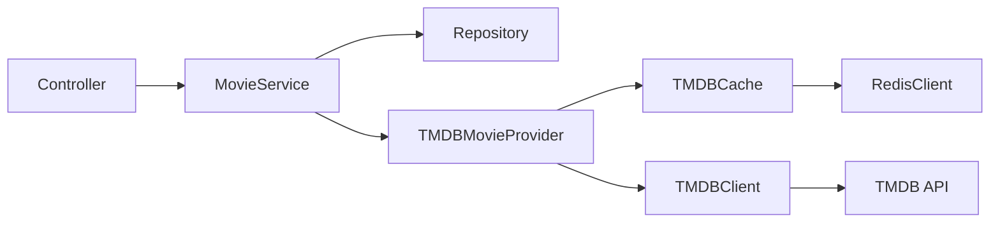

# TMDB Movie Provider — Technical Details

## Boundary and package layout

Controllers delegate to `MovieService`. The service receives a `MovieProviderProtocol` through its constructor and works with Cinelog-owned metadata, never upstream DTOs.

```mermaid
flowchart LR
    Controller --> MovieService
    MovieService --> Repository
    MovieService --> TMDBMovieProvider
    TMDBMovieProvider --> TMDBCache
    TMDBCache --> RedisClient
    TMDBMovieProvider --> TMDBClient
    TMDBClient --> TMDB[TMDB API]
```

The `app/providers/tmdb/` package exports only `TMDBMovieProvider`:

| Module | Responsibility |
|---|---|
| `provider.py` | Cache/client orchestration, identity checks, mapping into Cinelog metadata |
| `client.py` | Bearer authentication, absolute base URL, finite timeout, JSON/DTO validation and HTTP error translation |
| `schemas.py` | Private TMDB wire DTOs and cache envelopes |
| `validation.py` | Private TMDB date parsing and numeric score normalization/constraints |
| `cache.py` | Source-specific keys, TTLs, generation scopes and snapshot serialization |

Shared access lives in `app/infrastructure/postgres.py` and `app/infrastructure/redis.py` (`RedisClient`). Domain caches remain beside their application services. The retired database package and service-level TMDB/Redis modules have no compatibility aliases.

## Cinelog contracts

`app/providers/movie_provider_protocol.py` defines the provider-neutral search and detail contract. Queries and result DTOs live in `app/schemas/movie_provider_schemas.py`:

- `MovieSearchQuery`: query and supported locale.
- `MovieDetailsQuery`: external ID string, supported locale, internal `force_refresh=False`.
- `MovieSearchResultDTO`: pagination, search items and acquisition time. Search items cannot establish complete detail synchronization.
- `MovieMetadataDTO`: external source reference, optional canonical identity, common metadata, localized text, source-qualified external rating, observation time and an opaque source snapshot.

The result models and their nested components use the `DTO` suffix; input queries retain `MovieSearchQuery` and `MovieDetailsQuery`. These internal types use Pydantic `BaseModel`, independently of the public HTTP schemas and their camelCase aliases.

`app/schemas/movie_import_schemas.py` defines `MovieCreateDTO`, the separate input contract for `MovieRepository.create_movie()`. It deliberately has no canonical ID field and rejects extra fields. Its `from_metadata()` factory selects the importable fields from `MovieMetadataDTO`. The import module depends on the neutral provider DTOs; provider queries/results do not depend on the import contract.

The TMDB adapter always leaves canonical identity unset. Original title/language and common values remain distinct from requested-locale title, overview, tagline and genre labels. The locale denotes the requested source language; TMDB can supply fallback text, so it is not proof that every field is translated. Future translation policy belongs to #214.

Dates are date-only values internally. `TMDBReleaseDate` in `app/providers/tmdb/validation.py` handles the source's date format: empty, absent or null release dates become `None`; malformed nonempty dates are errors. Existing optional images, runtime, tagline, homepage and IMDb ID accept absence/null. Neutral Cinelog DTOs receive `date | None` and do not depend on these upstream parsing rules.

Search titles are the only exception to the required-field policy: an absent, null, empty or whitespace-only title causes the provider to omit that item during mapping. All other item fields are validated first, including those of untitled items; a missing required field or malformed value still fails the request with `MOVIE_PROVIDER_INVALID_RESPONSE` (502). A title of the wrong type also fails validation. Retained titles and result order are unchanged. The provider preserves TMDB's `page`, `total_results` and `total_pages`, so a returned page can contain fewer items, including zero. The cache keeps the source DTOs, and the same filter runs on fresh responses and cache hits. Details require a nonblank title and never use this omission policy.

Search and detail vote averages accept numbers and numeric strings such as `"8.4"`, normalized to floats through `TMDBVoteAverage` in `app/providers/tmdb/validation.py`. Scores must remain finite and within TMDB's 0–10 scale; booleans, missing/null values, nonnumeric strings and out-of-range values produce 502. These source-specific types remain private to the integration and are not exported from `app.types`. No default score or clamping is applied. Other required fields and strict types remain unchanged, and identity mismatches are rejected.

`MovieService` explicitly maps neutral results into `movie_api_schemas.py`, preserving every released JSON field, numeric ID and camelCase alias. Unknown release dates remain empty strings on the numeric HTTP API. Expanded image/rating/UUID response contracts are outside #226.

## HTTP and application errors

`TMDBClient` calls `https://api.themoviedb.org/3`, using `Authorization: Bearer <TMDB_API_KEY>` and the full locale as `language`. `TMDB_TIMEOUT` defaults to 10 seconds and must be positive. A timeout is supplied even for an injected HTTP transport. There are no automatic retries.

| Condition | Application code | HTTP |
|---|---|---|
| Detail lookup returns upstream 404 | `PROVIDER_MOVIE_NOT_FOUND` | 404 |
| Transport failure, timeout, upstream 429 or 5xx | `MOVIE_PROVIDER_UNAVAILABLE` | 503 |
| Other unsuccessful status, malformed JSON/DTO or inconsistent identity | `MOVIE_PROVIDER_INVALID_RESPONSE` | 502 |

A search endpoint returning 404 is an invalid response, not an empty result. A successful empty search remains 200. Errors use the existing `AppException` JSON envelope without returning source response bodies, credentials or raw transport errors. `MOVIE_NOT_FOUND` remains the separate canonical-catalog error.

## Cache and observation time

`TMDBCache` stores validated source DTOs with `observed_at` in an envelope. The provider constructs and validates the mapped fields before reading the UTC clock once to assemble a fresh result; the same timestamp is stored in the snapshot. Only successful results are cached. Cache hits reuse the original timestamp without reading the clock and do not slide the TTL.

| Operation | Key | Default TTL |
|---|---|---|
| Search | `cinelog:tmdb:search:v2:{locale}:{normalized_query}` | 600 seconds |
| Details | `cinelog:tmdb:details:v2:{locale}:{external_id}:generation:{generation}` | 86400 seconds |

Search normalization retains the existing trim/lowercase behavior. `TMDB_SEARCH_CACHE_TTL` and `TMDB_DETAILS_CACHE_TTL` retain their existing configuration roles. Old keys are not read or rewritten; they expire with their original TTL. Rollback remains isolated because old and new versions use different namespaces.

Detail generation uses the shared functions in `app/infrastructure/cache_generation.py`, passing the cache's `RedisClient`, context `tmdb-details:v2` and scope `{external_id}:{locale}`. Counters are persistent and default to zero. A read captures the generation before retrieving the payload; a subsequent fill writes using exactly that captured generation. Invalidating during an in-flight request therefore cannot repopulate the current generation with that request's older result.

`MovieDetailsQuery(force_refresh=True)` increments only that film/locale generation and bypasses the cached payload. This is the internal capability for #227; no endpoint exposes it and no current flow automatically requests it. Other films, locales and search caches are untouched. Superseded values expire normally. Generations do not coalesce concurrent requests; the future refresh policy owns its synchronization guard.

Example: a detail acquired at 10:00 and imported from Redis at 14:00 is persisted with `tmdb_last_synced_at=10:00`. Search observations and Redis reads never become successful detail synchronization markers.

Invalid cached JSON or a snapshot that no longer passes DTO/envelope validation is treated as a cache miss. The provider fetches fresh TMDB data and replaces the entry only after successful validation and mapping, using the newly acquired observation time. Detail recovery retains the generation captured before reading the invalid entry; it neither increments nor rereads it before writing. The invalid entry is not deleted separately, which avoids removing a concurrent successful fill. Upstream failures still produce the application errors listed above and do not write a replacement.

Redis operation failures and generation-counter errors continue to propagate. Redis remains mandatory at application startup; recovery from unreadable snapshots does not change connection-failure handling or other cache policies.

## Import and persistence compatibility

`find_or_create_movie` checks the existing numeric lookup first. Existing movies return without provider calls. First import requests `en-US`, then uses `MovieCreateDTO.from_metadata()` to select the neutral import fields for the repository's single creation method, `create_movie(data: MovieCreateDTO)`. The conversion retains the observation timestamp and opaque source snapshot, and excludes the optional canonical identity.

The repository adapts that input to the existing `tmdb_id`, `tmdb_payload` and `tmdb_last_synced_at` columns until #248. It stores the source snapshot opaquely and commits the original observation timestamp with the metadata. A source payload or optional canonical identity cannot assign/overwrite the database-generated UUID. Duplicate concurrent imports converge through the existing unique constraint and conflict read. A soft-deleted conflicting row is not resurrected or duplicated.

No database schema migration, metadata refresh on log/rating writes, additional provider or background task is introduced.

## Composition and lifecycle

`provider_dependency.get_movie_provider()` is the production composition seam. The cached `get_movie_service()` uses it, and log/rating services share that movie service. There is no module-level provider instance in the movie controller.

`TMDBMovieProvider.get_instance()` lazily owns one `TMDBClient`, which owns one `httpx.AsyncClient` unless explicitly injected. Provider shutdown closes only its owned client; the HTTP wrapper closes only its owned transport. Neither provider nor source cache closes the shared Redis connection.

Application shutdown closes Redis, the provider and PostgreSQL and clears movie/log/rating service compositions. A later lifespan can obtain fresh components rather than retain a closed provider.

## Testing

- Private integration tests under `tests/units/providers/tmdb/` use mocked HTTP responses and injected caches, including original timestamps, locales, untitled search filtering with unchanged pagination, score/date normalization, malformed values, identity mismatches, corrupt-cache recovery and generation races during both ordinary fills and recovery.
- Service/repository/controller tests consume neutral or public types, not TMDB DTOs.
- E2E fixtures replace the provider factory with `FakeMovieProvider`, clearing dependency caches before and after each test. HTTP and mapping are tested separately, and no live TMDB request is needed.
- E2E retains real PostgreSQL/Redis, Uvicorn HTTPS and Secure-cookie coverage. Process/SMTP changes belong to #249.

Run `make test-unit`, `make lint`, `make format-check`, `make typecheck` and `make test-e2e`.

## See Also

- [Functional: Movie Search and Details](../functional/tmdb-service.md)
- [Redis Caching](redis-caching.md)
- [Service Dependencies](service-dependencies.md)
- [Account Localization](localization.md)
- [Architecture](../../ARCHITECTURE.md#tmdb-integration)
